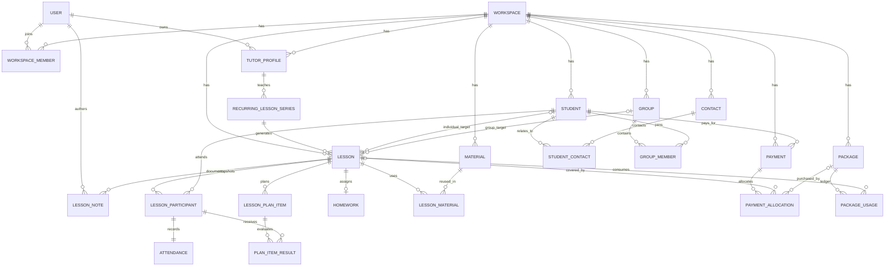

# easy4tutor architecture

## Stack and application layers

easy4tutor uses Next.js 16 App Router, React 19, strict TypeScript, Zod, TanStack Query, Supabase Auth, PostgreSQL 17, private Supabase Storage and Vitest/pgTAP. Production runs on Vercel; scheduled work is invoked by an external scheduler and executed by authenticated Route Handlers.

```text
React UI
  ↓ typed AppAction + centralized Zod validation
Next.js Route Handler (/api/app)
  ↓ authenticated user and normalized errors
Application service (src/server/app-service.ts)
  ↓ domain rules (src/server/domain/*)
Repository (src/server/repository.ts)
  ↓ Supabase session + RLS
PostgreSQL normalized domain tables
```

The existing file store remains a development adapter. In Supabase, `students`, `contacts`, `student_contacts`, `groups`, `group_members`, `lessons`, `lesson_participants`, `attendances`, `recurring_lesson_series`, `availability_rules`, `availability_exceptions`, and `calendar_blocks` are the read/write source of truth for normal people and scheduling workflows. Stage 1A people commands and Stage 1B scheduling commands write relational tables directly through RLS-scoped repository mutations and narrowly scoped database functions. `teacher_states` is retained temporarily only for statistics imports and selected settings/admin compatibility flows.

## Tenancy and security

`Workspace` is the tenant. A solo tutor receives one workspace, an active owner membership and a tutor profile at signup. A future small team adds `WorkspaceMember` rows with `owner`, `admin` or `tutor` role; Stage 0 deliberately does not add a detailed permission matrix.

Every business table has `workspace_id`. Cross-entity relationships use `(id, workspace_id)` composite foreign keys where a wrong-tenant reference would otherwise be possible. All public business tables have RLS. Policies call `private.is_workspace_member(workspace_id)`; the helper is `SECURITY DEFINER`, has an empty search path, lives outside the exposed schema and is not executable by `PUBLIC`. SaaS admins are not workspace members and therefore cannot read student, lesson, material or financial content.

Authentication identity remains in `auth.users`; `profiles` contains only application profile fields. Provider credentials remain encrypted server-side and are never returned by the client-facing integration query. New tables have explicit Data API grants because automatic table exposure is disabled.

## Domain model

- **User/Profile** — authentication identity and non-secret account profile.
- **Workspace** — tenant defaults for timezone, currency and locale.
- **WorkspaceMember** — user membership and coarse team role.
- **TutorProfile** — tutor defaults inside a workspace.
- **Student** — archivable learner profile; monetary defaults use integer grosz.
- **Contact / StudentContact** — parent, guardian or billing contact independent of the learner.
- **Group / GroupMember** — reusable group and temporal membership, never a JSON ID list.
- **Lesson** — source of truth for a scheduled or delivered teaching session. It targets exactly one student or one group.
- **LessonParticipant** — immutable-at-the-time participant snapshot used by individual and group lessons.
- **Attendance** — per-student attendance for every lesson.
- **RecurringLessonSeries** — timezone-aware recurrence rule. Generated occurrences are persisted as Lessons.
- **LessonPlanItem / PlanItemResult** — shared plan and participant-specific outcome.
- **LessonNote** — typed/visibility-aware lesson note, separate from student notes.
- **Homework** — lesson-specific assignment for a student or group.
- **Material / LessonMaterial** — reusable material linked to many lessons.
- **Payment** — movement of money, separate from lesson delivery.
- **PaymentAllocation** — allocation of one payment to a lesson or package.
- **Package / PackageUsage** — purchased entitlement plus append-only consumption/reversal ledger.
- **AvailabilityRule / AvailabilityException** — recurring or one-off availability and date exceptions.
- **CalendarBlock** — non-lesson busy time; it is not disguised as a Lesson.
- **Booking** — pending request/intention. A confirmed teaching session becomes a Lesson and the booking stores `converted_lesson_id`.
- **ReminderDelivery** — external delivery job; supports channel and schedule.
- **Notification** — in-app notification, separate from external reminders.
- **IntegrationConnection** — workspace-scoped provider connection and encrypted credentials.

## Relationships



## Lesson lifecycle

```text
scheduled → needs_completion → completed
scheduled → cancelled
scheduled → no_show
needs_completion → cancelled
```

`completed_at` exists only for `completed`; `cancelled_at` exists only for `cancelled`. A completed lesson cannot be cancelled by the normal domain transition. Reversing completion through the package workflow removes `completed_at`, records a ledger reversal and returns the lesson to `needs_completion`.

## Recurring lessons

A series stores frequency, interval, multiple ISO weekdays, local start time, duration, timezone and optional end date. Each occurrence is a normal Lesson with `recurring_series_id` and `recurrence_original_starts_at`. Editing one occurrence changes that Lesson while retaining its original occurrence key. Editing future occurrences closes the current series and creates a successor linked through `parent_series_id` and `effective_from`; already-created history remains unchanged. Cancelling one occurrence changes one Lesson; cancelling a series changes the series and its eligible future Lessons in one application transaction.

## Payments and packages

Lesson answers “what teaching happened”; Payment answers “what money moved.” `PaymentAllocation` can target one Lesson or one Package and a trigger prevents total allocations from exceeding the payment. Currency is explicit and amounts are integer minor units (`amount_grosz` / `price_grosz`), never floating point.

`Package.remaining_lessons` is not stored. `package_balances` derives it from `PackageUsage` consumption and reversal entries. `complete_lesson_with_package` locks the package row and enforces one consumption per package/lesson plus an idempotency key. `reverse_lesson_package_usage` appends one reversal and restores the derived balance.

## Booking decision

Booking remains separate only while a request is pending or awaiting confirmation. It must not replace Lesson. Conversion is explicit and one-way through `converted_lesson_id`; after conversion, Lesson is the scheduling and delivery source of truth.

## Time strategy

Absolute instants use PostgreSQL `timestamptz` and ISO UTC at API boundaries. Workspaces, tutors, lessons, recurrence rules and availability retain an IANA timezone. Recurrence generation constructs each local wall-clock occurrence in its series timezone before converting to UTC, so CET/CEST changes do not shift a 17:00 lesson to 18:00 or 16:00 local time.

## Deletion and GDPR foundation

Students, groups and materials use archive fields/statuses. Normal authenticated grants do not permit physical deletion of lessons, students, groups, payments, packages or materials. Join rows and availability rules may be removed. Completed lessons and financial records use restrictive foreign keys. Student export can traverse workspace-scoped relational tables; future anonymization can clear removable profile/contact fields while retaining legally required financial facts and stable identifiers. Critical audit events are intentionally deferred until their exact legal/product scope is defined.

## Transaction boundaries

Lesson creation, recurring-series creation, rescheduling/splitting, cancellation, conflict checks, participant snapshots, reminder refresh, and Google sync-job enqueueing run in PostgreSQL transactions. Per-tutor advisory transaction locks serialize competing scheduling commands; half-open interval checks allow adjacent events while rejecting true overlap. Request IDs make lesson/series creation idempotent, and `updated_at` guards reject stale reschedule/cancel/block writes. Package completion/reversal and payment allocation keep their existing row-locking/idempotency boundaries. RLS and composite workspace foreign keys remain the final tenant boundary.
